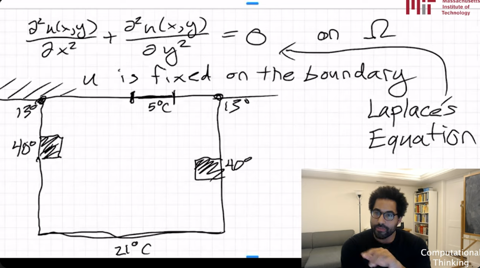

# Lecture 18 - Multigrid methods

https://www.youtube.com/watch?v=rRCGNvMdLEY&feature=youtu.be

Example of heating a room. `u` is fixed on the boundary. Various node have different temperatures.



What is the final condition, once things have reached equilibrium?

Continuous representation:

$$
\frac{d^2u}{dx^2} + \frac{d^2u}{dx^2} = 0
$$

Discretized representation:
$$
$$u(i+1,j) + u(i,j+1) + u(i-1, j) + u(i, j-1) - 4u(i,j) = 0$$

The problem is then to solve the above for $(i,j)$ in our grid.

---$$

Setup:
1. Defined a grid.
2. Defined boundary_conditions.
3. (bonus) Visualized colors based on heat.
4. Now, run jacobi a bunch! `jacobi_step`
   - iterates over every point in the interior of the array
   - `T'` is the update (the "discretized representation" below)

Works, but what if we want something more accurate! This was grainy/coarse 32x32 grid.

We can also improve by setting a better initial condition. One idea: "linear interpolation". Take a weighted average of the temperature at the four walls (due N, S, E, W), based on how far it is from wall.

Problem: moving to a fine grid (say: 1024x1024), each iteration gets very expensive.
New approach: For initial condition, use the *exact solution* from the course grid (with given error bound).

Running `n` iterations on a coarse grid is MUCH faster than `n` iterations on a fine grid. This is because the number of operations on the fine grid is MUCH higher!

For example:

```
16x16 grid        is 2^4  x 2^4
1024x1024 grid    is 2^10 x 2^10
```

That means there are roughly 2^12 (~4000) times as many operations per iteration through the finer grid.

The algo we ultimately use is to start coarse and iteratively get finer, until we get to a given grid resolution.

`multilevel(T, k_final)`

`T` is initial guess for values
`k_final` is the final resolution of a grid we want

--

This was a "cascading" algo. More sophisticated versions of this algo:
- V-Cycles
- W-Cycles

More info on those here: https://en.wikipedia.org/wiki/Multigrid_method

tldr: Focus on the *problem* you're trying to solve. Don't compute more than you have to.

> You choose your discretization. And you choose what level of discretization you want when.
