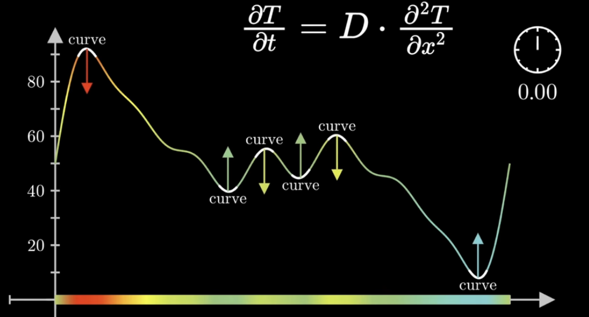

# Lecture 22 - Diffusion Equation

https://www.youtube.com/watch?v=a3V0BJLIo_c

## Getting to diffusion equation, from random walks

Diffusion Equation is a Partial Differential Equation (PDE)

Describes how things spread, e.g. spread of temperature. How specifically dos this happen?

We'll focus on molecular diffusion (density of a gas).

Real model is very complex. Lots of different forces. Brownian motion.
We'll simplify it by "randoming walking" all the molecules. Ignore other interactions.

We are NOT modeling pressure. Part of what makes it move is the increased number of collisions and interactions.
Instead, we'll model it from statistics of random walks.

Our question: how can we describe this spread as a function?

For models, we often need a separate rule for what happens at the boundary.$$

Normally, it's 50% left and 50% right in the 1d model.
Boundary could be: (1) 50% stay or 50% move  (2) 50% escape or 50% move (3) etc...

"flux" = difference in density

It's a "difference of differences"

$$\Delta_t p = 1/2 * \Delta_x * (\Delta_x p_n)$$

.. from here we can eventually work to a "diffusivity constant":

$$D = \frac{1}{2} \frac{(\Delta x)^2}{\Delta t}$$

"how quickly are these particles moving?

As we consider smaller time and spatial steps, but keep D constant... we get to the "Diffusion Equation":

$$\frac{\delta p}{\delta t} = D * \frac{\delta^2 p}{\delta x^2} $$

## Temperature example

$$\frac{\delta T}{\delta t} = D * \frac{\delta^2 T}{\delta x^2} $$

Temperature ($T$) is changing in time ($t$).
Temperature ($T$) is also changing in space ($x$).

The way that a temperature changes at a given point is related to the "curvature" (aka "second derivative", aka "concave or convexity") at that point.

Things get smoother over time. Wherever the curves are sharper, that's where things change more quickly.

We did a 1d appraoch before. (flux in one dimension)
It's easy to move to a multi dimensional (flex in >1 dim) approach.

$$\frac{\delta p}{\delta t} = D * \frac{\delta^2 p}{\delta x^2} $$

=>

$$\frac{\delta p}{\delta t} = D * (\frac{\delta^2 p}{\delta x^2} + \frac{\delta^2 p}{\delta y^2} + ...)  $$

The idea of adding a bunch of partial derivatives can be written concisely as:

$$= \nabla^2 p = \nabla \circ \nabla p $$

which says "how different is a point in space from its neighbors?"

The operator where we're adding all the second derivatives is known as the "Laplacian". In 2 dimensions this looks like:

$$\nabla^2 p(x,y) = \frac{\delta^2 p}{\delta x^2} + \frac{\delta^2 p}{\delta y^2}$$

Take the average of the values of the neighbors. If it's higher, than laplacian is positive; else, it's negative.

## Bonus

In real gas, you need to consider how the molecules interact with each other. Lots of complex, nonlinear interactions.

Also: discrete and continuous models often allow you to go back and forth. Even though we can describe it continuously (we could solve it exactly with fourier series), most PDEs we cannot solve directly. So we use a computer to discretize space and time and go back to a discrete model!

*Discrete* is how these things are handled *in practice*, for the computational part.

