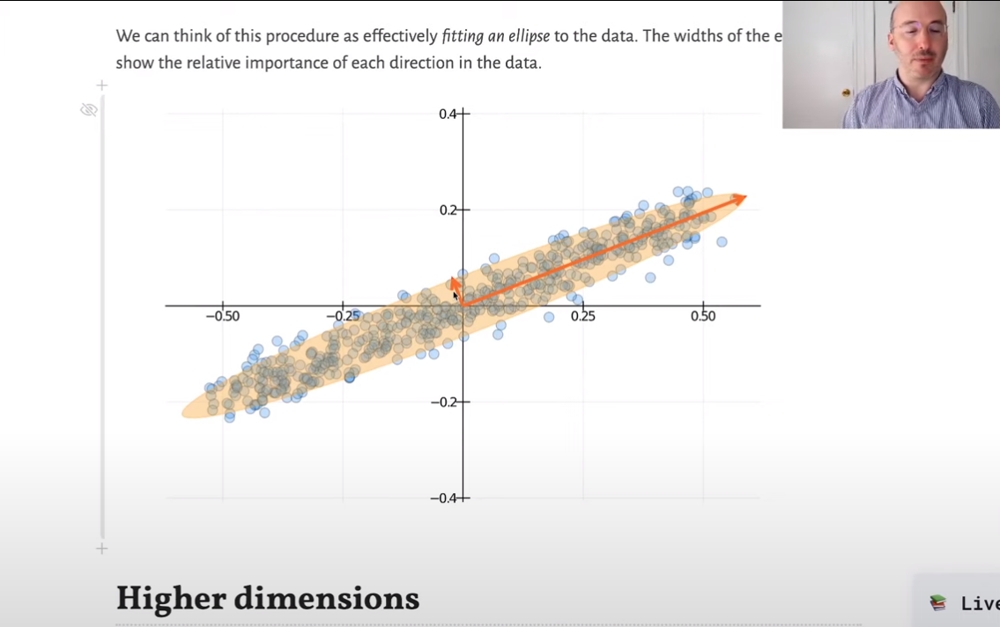

# Lecture 6 - Understanding Structure in Data

So far we've looked at images as sources of data.
This lecture: get the intuition behind Principle Component Analysis (PCA).
(We won't get deep into implementation. Will focus on computational point of view.)

## Flags

Recall that a multiplication table is also called an outer product.
In our case, an "Outer Product" takes two vectors, and computes the products of all their pairs.

Many country flags can be represented in this manner.

```
flag = outer([1,0.1,2], ones(6))
```

Combined with a function mapping numbers to colors, this creates 3 bands of different colors.

```
show_image(flag)
```

What is a more general kind of multiplication table?

A generalized mul

## Rank of a Matrix

Rank comes from Linear Algebra. In our case, it's sufficient to think of "Rank" as "how many different kinds of columns there are".

> A matrix that can be written exactly as a single multiplication table is called a rank-1 matrix. If it can be written as the sum of two multiplication tables, it is called rank 2, etc

In the real world, there's never a perfect rank-1 matrix. Instead, there's noise. How do we discover how close this noisy matrix is to the actual rank-1 matrix?

## Images as Data

Treat image as a *data matrix*. Let's say it's 2x20. If we plot row 1 vs row 2, then we are actually thinking of each column in the image as a 2d vector (or a point, which we can plot!). Now we can visualize how the columns relate.

A rank-1 would be a straight line, whereas slightly noisy data falls close to a straight line.

Once we get beyond 2 or 3 dimensions, we cannot visualize the data like this. But the numerical techniques generalize.

We'll want to use (drumroll).. **statistical techniques**.

## Size of the data Cloud

`using Statistics`

1. center around the mean
2. now we want to find how far away points are
    - use `stddev` for EACH of the coordinates (`x` and `y`).
    - this gives us the cloud projected onto each axis (`x` and `y`).
3. compute the "width"  and "height"
4. do 2 stddevs instead of 1
    - if normally distributed then ~95% in 2 stddev, whereas only ~70% in 1 stddev
    - so this doesn't strictly include all data. but close.
5. given correlated data, figure out min/max width
   - we can see data is correlated, and the box doesn't represent that linear slope.
   - we now want to get the data aligned in a straight horizontal line, such that the width viewed from that direction is minimized (spread out the least) and maximized (spread out the most)
   - we can do this by plotting the variance as we rotate (`theta`).
   - There are MANY numerical methods to optimize (solve for min/max).
6. compute our two vectors!
   - they are (always) perpendicular
   - we can also this of this as "fitting an ellipse" to our data.



Thinking in higher dimensions:

- Rank 1 is a line
- Rank 2 is a plane
- Etc

## Application: A Simple Recommendation Engine

- `missing` in Julia is a special type to denote missing data
- our goal is to fill in missing values ("impute" = fill in)

Our goal is to approximate the missing values with a Rank 2 matrix.
(A higher rank approximation gives better quality)


